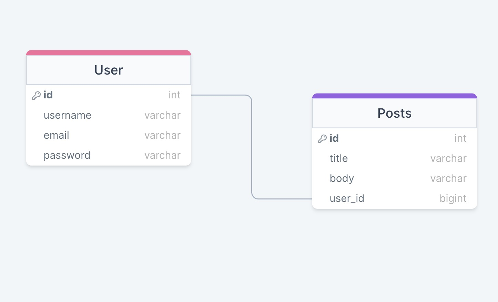

# Pre-Requisites 

Node.js and nodemon are required to be installed in thei sfile or gloally on the machine that is running it.
# Installation Instructions:
## 1. Create an empty repo on your local machine and cd into it
## 2. Go to https://github.com/ndaly94/Project-2-Fake-BlogFrog and go to the "code" dropdown menu. Select SSH and copy and paste
## 3. In the empty directory type in "git clone <paste SSH here>" and hit enter
## 4. Open the repo in VS Code by typing code . in the command line
## 5. Install the primary dependencies with the command "npm i express bcrypt dotenv jsonwebtoken mongodb-memory-server mongoose morgan"
## 6. Install the dev dependencies with the command "npm i --save-dev supertest jest mongodb-memory-server artilery"

# Diagram and Wireframe

# Dependencies needed to run:

Express, Node, dotenv, MogoDB, Mongoose, bcrypt, jwt, morgan, MongoDB-Memory-Server, Jest, Supertest
To run in dev mode nodemon must be installed globally. To run "DEV" type 'npm run dev' in the terminal.
To start the app run 'npm start'

https://trello.com/b/6nMpdnLV/blogfrog-project

## Route Breakdown
### User
### createUser
route on '/users' that allows the backend to create a new User. Uses the POST method. The new User must be made based on the user Schema that is defined in the models folder. When creating a user we do not generate an auth token, the auth token is generated when we login to the user. 
### indexUsers
route on '/users' that renders all users stored in the database via JSON. This is done via the GET method
### getUserById
route on '/users/:id' that renders a specific user from the database. This is done with the GET method. This route also requires proper authorization for the user's data to be accessed. 
### loginUser
route on '/users/login' which logins a specific user based on their email and password. Upon a succesful login a new authorization token is generated and grants access to all of that users data and the corresponding methods which require authorization. The loginUser route uses the POST method.
### updateUser
route on '/users/:id' which allows us to change the info of a previously existing user. This requires the user to be authenticated in order to make these changes and the changes much fit the same User Schema which it was initially created in. The updateUser message uses the PUT method. 
### deleteUser
route on '/users/:id' which allows us to delete a specific user. User Authentification is required to complete the deletion process. The deleteUser message uses the DELETE method. 

# Posts

## Controller Breakdown
### User
### Posts

## Model Breakdown
### User
The User Model is created based on a Mongoose Schema. A username, an email, and a password are required for the creation of a new user. Users are also linked to the posts they created on the blog, however they are not a required field. Each user must have a unique username and email address and the creation of the user is timestamped. 
The User also has its own unique Bearer auth token which is crewated via the generateAuthToken method and leverages the json-web-token dependency. 

### Post

## Test Routes

### User

### Posts

## Challenges
When creating this API I ran into issues regarding my package.json which led to a few hours of troubleshooting before haiving to reach out for help from my instructional team. I had installed unnecassary dependencies which in turn threw errors when attempting to run basic routes.

Additionally, after completing that portion of the troubleshooting I individually tested each route using Postman. In that testing process I found that my blog post's routes were not working as intended. Upon checking my Router function I had entered a redundent '/posts' on the routes in the posts.js routes file. They were redundent because I had already indicated in my app.js at the postRoutes would correspond to '/posts' in my app.use file. This made it so that to create a new blog-post or index them I had to go to '/posts/posts' a redundent url line. Once this fix was made the code began working as intended and I learned to always double check your url routing, a lesson Im sure I should have already learned. 

While attempting to create testing routes for my app I ran into compatability issues regarding jest and Node.js. Looking into my package.json I found that when initially installing jest it had installed on version 25 which was an outdated version. After following this link: https://mongoosejs.com/docs/jest.html#recommended-testenvironment. I found that jest before version 26 were made to be used in JSDom and to use Node you either have to upgrade or change the testing enviornment. I unfortunately could not find where in the node_modules/ the testing enviorment change was so I opted to update the jest version. npm update jest refused to work so I opted to uninstall jest and reinstall forcing it to install the current version, 29.5.0. I did this with the following command npm i jest@29